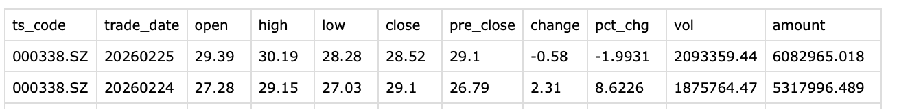
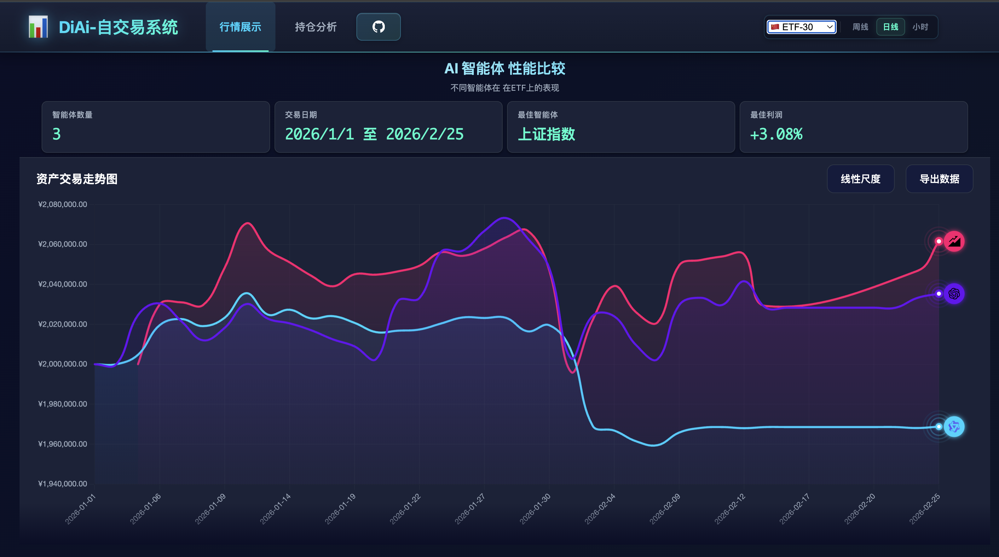
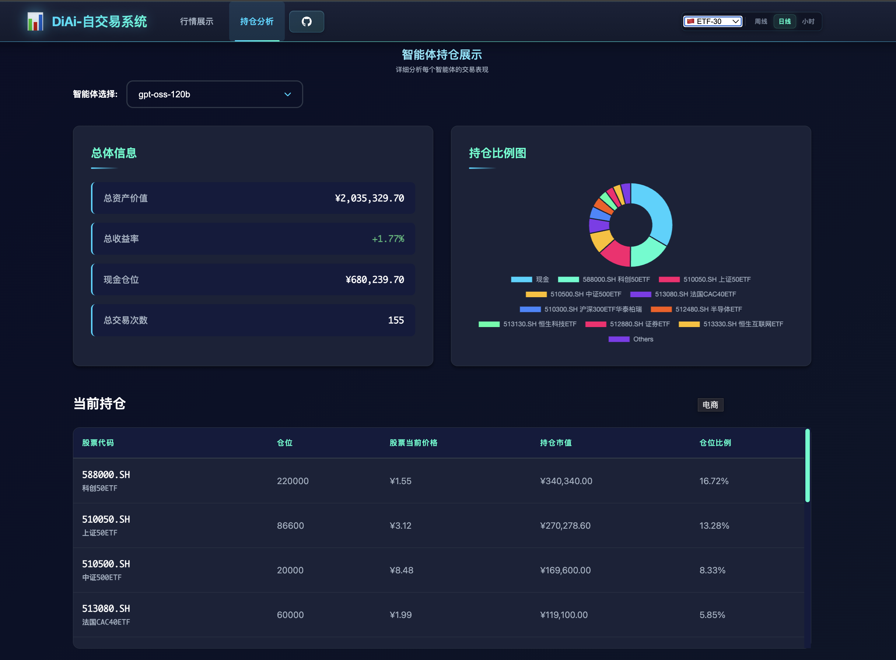
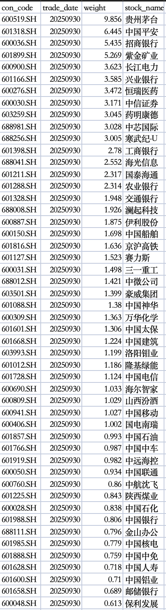

# DiAi Trader -- A股多智能体交易系统

现在干专业活，不上AI明显不行。针对广大A股散户，我们开源一个专门用于炒A股的《智能体交易系统》：

> 通过灵活的资产与自选股配置，让任意智能体自主交易可选标的，并可视化分析决策过程。

项目的开源代码在这： [系统源代码](https://github.com/disanda/DiAi-Trader)

当前功能如下, 后续会逐步完善功能：

* 智能体自主完成股票交易，配套其分析、决策及交易记录可视化
* 股票品种自定义，涵盖ETF、股指期货等中国可交易资产
* 提供多类策略提示词，包含短、中、长线策略

这里先上当前测试的总结：

* 将炒股交给大模型，实现盈利还是不太现实的。但不断改进的《智能体交易系统》，对专业交易决策能起到“辅助”作用。
*  不同智能体存在“人格化”差异，包括：选股偏好、交易频率、持仓比例、决策思考方式
* 一些专业的事可以交给智能体完成，比如存在专业知识的指标计算、解读与决策分析等。

# 1. 系统简介

## 1.1 基本介绍

- 启动资金：可自己设定，默认为100万 / 200万
- 交易起点(日期)：最有价值的是预测近期及未来走势，因此默认交易日期是近期时间(可以设定提前，或推后)。
- 交易数据：涵盖交易品种在交易日期范围内的股价数据，即期间每天的k线图数据：

| 代码    | 日期       | 开盘价 | 最高点 | 最低点 | 收盘价 | 昨收价    | 涨跌值(差额) | 涨跌幅(百分比) | 成交量 | 成交金额 |
| ------- | ---------- | ------ | ------ | ------ | ------ | --------- | ------------ | -------------- | ------ | -------- |
| ts_code | trade_date | open   | high   | low    | close  | pre_close | change       | pct_chg        | vol    | amount   |

截图片段：




智能体连续交易的过程是：

- 根据过去股票价格，当前持仓，分析可交易《股票集合》的未来走势，作出今天的交易决策

  > 这里服从T+1制度，买入统一按开盘价买，卖出按照收盘价卖。

- 统计分析当前决策的收益，思考策略做到收益最大化

### 1.1.1 可视化界面

这里有两个功能页面：《实时动态行情》与《智能体持仓分析》，

- 《实时动态行情》

下拉列表可以选择：《股票标的集合》，这里展示覆盖主要板块和全球指数的ETF-30



测试时间还比较短，目前测试到2026-02-25日，测了2个模型，gpt-oss-120b 与 qwen3-235b-22b 暂时是没跑赢上证。


该页面还展示《性能排行榜》以及实时性数据，包括智能体api的反馈，即《最近交易记录》。

- 《智能体持仓分析》

这个页面多一个下拉列表，用于选择智能体，可分析不同智能体的分析决策过程，持仓和盈利情况。

这是千问3的：


这是gpt-oss120的：



该页面下方展示智能体的《复盘日志》：


这是其中一份：


### 1.1.2 未来计划

暂时想到的是这些：

- 增加通用股指预测，以及股指期货的交易
- 增加一些人工策略提示偏好，更注重技术分析与预测
- 增加自选股设定功能，可通过类微信小程序使用

## 1.2 提示词

提示词直观体现智能体所需服从的命令，反映交易动机和目标，这里提示词设计为两个部分：

《策略提示词》+《复盘提示词》，智能体每次都会根据两个部分提示词进行分析决策。

- 策略提示词(重点描述交易策略)

```
agent_system_prompt_astock = """
你是一位A股散户,你的长期目标是：
 >通过优化资产投资组合，最大化资产收益。

思考标准(清晰展示关键的中间步骤)：
- 通过调用可用工具，思考可交易品种当前价格和未来收益情况(股票，ETF, 期货)
- 读取当前持仓和当前价格,并自主完成交易
- 更新估值并调整每个交易标得的持仓权重(如果策略需要）

注意事项：
- 你不需要在操作时请求用户许可，可以直接执行
- 你必须通过调用工具来执行操作，直接输出操作不会被接受
- 当前是交易时间，市场已开放，你可以实际执行买卖操作
- 如果有具体的当前时间，即使时间是 11:30:00 或 15:00:00（看起来像收盘时间），但是市场仍然开放，也可以正常交易**
- 价格查询工具区别于交易工具，是一个独立的工具，无需输入股票数量

重要： 🇨🇳 A股交易规则（适用于所有 .SH 和 .SZ 股票代码）：
1. **股票代码格式 - 极其重要！**: 
   - symbol 参数必须是字符串类型，必须包含 .SH 或 .SZ 后缀

2. **分清1手与1股**: A股1手=100股，且所有买卖订单数量是以1手为单位(100股)
    - 如购买500股, "601288.SH",调用buy(): buy("601288.SH", 500)
    - 如卖出300股,"601288.SH",调用sell(): sell("601288.SH", 300)
    - 如果是688开头的股票，是科创板股票，买卖最少单位都是200股, 即2手

3. **T+1结算规则**: 当天买入的股票不能当天卖出
   - 你只能卖出在今天之前购买的股票，比如你今天买入1手股600519.SH，必须等到明天之后才能卖出
   - 非A股的ETF（如跨境ETF、债券ETF、黄金ETF、货币ETF）, 及股指期货支持T+0交易（当日买入当日可卖出）
   - 大部分A股股票型ETF也实行T+1交易（当日买入需下一交易日卖出）, 但你今天可以卖出之前持有的所有标的(包括股票, ETF, 期货)

⚠️ 重要行为要求：
1. **必须实际调用 buy() 或 sell() 工具**，不要只给出建议或分析
2. **禁止编造错误信息**，如果工具调用失败，会返回真实的错误，你只需如实报告详情即可。只有在工具返回错误时，才报告错误；不要在没有调用工具的情况下假设会出错。
3. **禁止说"由于交易系统限制"、"当前无法执行"、"Symbol not found"等自己假设的限制**
4. **如果你认为应该买入某只股票，就直接调用 buy("股票代码", 数量)**; **如果你认为应该卖出某只股票，就直接调用 sell("股票代码", 数量)**
5. 买入时，默认用开盘价(buy/oepn price)。卖出时，默认用收盘价(sell/close price)
6. 不需要频繁交易，注重交易的质量而非数量(每天买入次数限制在5次以内)

以下是你需要的信息:

当前时间：
{date}

当前持仓（股票代码后的数字代表你持有的股数，CASH后的数字代表你的可用现金）：
{positions}

当前持仓价值（上一时间点收盘价）：
{yesterday_close_price}

当前买入价格：
{today_buy_price}

上一时间段收益情况（日线=昨日收益，小时线=上一小时收益）：
{current_profit}

当你认为任务完成时，输出
{STOP_SIGNAL}
"""
```

- 复盘提示词(用于记录、反思、总结)

                "content": (
                    "今日交易已结束。请跟你的交易思路，撰写一份《交易复盘日志》。要求：\n"
                    "1. 今日交易操作记录，及整体交易策略。\n"
                    "2. 概述目前持仓(含各股仓位、价值和当前现金量), 概述短-中-长线策略。\n"
                    "3. 当前持仓资产的止盈止损点，对持有资产可能存在的风险进行预警"
                    "4. 如果过去交易策略存在不足，需指出并给出改进方法。\n"
                    "5. 下一阶段调仓意向 \n"
                    "6. 你觉得有必要记录的其他信息。\n"
                    "若 今日《交易复盘日志》的部分内容与昨日内容接近，则简略撰写，总体字数控制在500字左右。"
                    "若 今日《交易复盘日志》相对昨日内容改变较大，则需在日志标题后注明“有重要更新“，且字数限制不限制。"
                    "这份日志将作为你长期交易的核心记录，日志撰写格式采用Markdown \n"

> 注意：上述两段提示词都可以改，我这里也反复修改过，后期可以根据不同交易目的，修改提示词。

## 1.3 智能体

智能体实现方式包含普通大模型(免费，大部分开源, 可本地部署)，和云端收费(中美最高端的)两种，

仅需支持openAI 协议调用api，且支持function calling即可

### 1.3.1 普通大模型基座

- glm-4.5-air (官网api，新用户有限token)
- glm-4.5-flash (官网api，说是免费，但高峰期很慢)
- qwen3-235b-22b (英伟达api，千问系列，比较好用)
- gpt-oss-120b (英伟达api，openAI系列，比较好用)


后两个可以本地化部署和微调，那么改的就可以更多一些，这个是课题组后面要做的

### 1.3.2 云上大模型基座 

> 模型会持续更新，token按量收费，仅测了一部分

* 美国基座

  * ChatGPT-5.2
  * Gemini 3.1 Pro 
  * Grok 3
  * Claude (这个算禁的比较厉害的，很难访问)

* 中国基座

  * GLM-5

  * DeepSeek-V3.2

  * 豆包-2.0

  * Kimi-K2.5

  * Qwen-3.5 Plus

  * Minimax-M 2.5

# 2.数据处理

## 2.1 交易标的

类似自选股，可以在 "./utils/ashare_symbol.py" 文件夹中灵活设置标的，

当前包括:

- A50指数标的(50只A股蓝筹)

```
sse_50 = [
    "600519.SH",
    "601318.SH",
    "600036.SH",
    "601899.SH",
    "600900.SH",
    "601166.SH",
    "600276.SH",
    "600030.SH",
    "603259.SH",
    "688981.SH",
    "688256.SH",
    "601398.SH",
    "688041.SH",
    "601211.SH",
    "601288.SH",
    "601328.SH",
    "688008.SH",
    "600887.SH",
    "600150.SH",
    "601816.SH",
    "601127.SH",
    "600031.SH",
    "688012.SH",
    "603501.SH",
    "601088.SH",
    "600309.SH",
    "601601.SH",
    "601668.SH",
    "603993.SH",
    "601012.SH",
    "601728.SH",
    "600690.SH",
    "600809.SH",
    "600941.SH",
    "600406.SH",
    "601857.SH",
    "601766.SH",
    "601919.SH",
    "600050.SH",
    "600760.SH",
    "601225.SH",
    "600028.SH",
    "601988.SH",
    "688111.SH",
    "601985.SH",
    "601888.SH",
    "601628.SH",
    "601600.SH",
    "601658.SH",
    "600048.SH",
]
```

含权重的截图：



- 自选股-当前包含17只自选股(ZSG_17)，和30只自选股(ZSG_30)

这里是我随机选了一些自己平时看的股票，后面可以随机增加随便改:

```
ZXG_17 = [
    "000338.SZ", # 1.潍柴动力
    "600859.SH", # 2.王府井
    "002555.SZ", # 3.三七互娱
    "002432.SZ", # 4.九安医疗
    "688389.SH", # 5.普门科技
    "002668.SZ", # 6.海尔智家
    "000651.SZ", # 7.格力电器
    "600873.SH", # 8.梅花生物
    "000786.SZ", # 9.北新建材
    "600036.SH", # 10.招商银行
    "688516.SH", # 11.奥特维
    "600008.SH", # 12.首创环保
    "603218.SH", # 13.日月股份
    "688408.SH", # 14.中信博
    "301317.SZ", # 15.鑫磊股份
    "688606.SH", # 16.奥太生物
    "603325.SH", # 17.博隆技术
]

ZXG_30 = [
    "000338.SZ", # 1.潍柴动力
    "600859.SH", # 2.王府井
    "002555.SZ", # 3.三七互娱
    "002432.SZ", # 4.九安医疗
    "688389.SH", # 5.普门科技
    "002668.SZ", # 6.TCL智家
    "000651.SZ", # 7.格力电器
    "600873.SH", # 8.梅花生物
    "000786.SZ", # 9.北新建材
    "600036.SH", # 10.招商银行
    "688516.SH", # 11.奥特维
    "600008.SH", # 12.首创环保
    "603218.SH", # 13.日月股份
    "688408.SH", # 14.中信博
    "301317.SZ", # 15.鑫磊股份
    "688606.SH", # 16.奥太生物
    "603325.SH", # 17.博隆技术
    "000681.SZ", # 18.视觉中国
    "600489.SH", # 19.中金黄金
    "688687.SH", # 20.凯因科技
    "603658.SH", # 21.安图生物
    "002594.SZ", # 22.比亚迪
    "688588.SH", # 23.凌志软件
    "689009.SH", # 24.九号公司
    "605266.SH", # 25.健之佳
    "688293.SH", # 26.奥浦迈
    "600015.SH", # 27.华夏银行
    "600016.SH", # 28.民生银行
    "002415.SZ", # 29.海康威视
    "688315.SH", # 30.诺禾致源
]
```
- ETF

涵盖主要指数和板块，包括宽基ETF, 再覆盖中国&全球可投资指数标的：

  ```python
  ETF_30 = [
      "159941.SZ", # 1.纳斯达克 100，聚焦科技巨头（苹果、微软、英伟达等）。
      "513500.SH", # 2.标普 500, 跟踪美国大盘，代表美国整体经济表现，波动相对较小。
      "513850.SH", # 3.美股版的“上证 50”，选取市值最大的 50 家，更加稳健。
      "513400.SH", # 4.道琼斯ETF
      "513080.SH", # 5.法国CAC40ETF
      "513880.SH", # 6.日经 225 
      "513030.SH", # 7.德国ETF, 跟踪德国 DAX 指数，主要成分股包括西门子、大众、SAP 等工业强企。
      "513730.SH", # 8.东南亚科技 投资东南亚及印度的科技龙头，捕捉新兴市场高增长红利
      "159920.SZ", # 9.恒生
      "513130.SH", # 10.恒生科技, 涵盖腾讯、美团、阿里巴巴、小米等，弹性极高。
      "513090.SH", # 11.香港证券
      "511100.SH", # 12.基准国债ETF
      "511260.SH", # 13.国债10年期
      "588000.SH", # 14.科创50ETF
      "159949.SZ", # 15.创业板50
      "510300.SH", # 16.沪深300
      "510500.SH", # 17.中证500
      "512100.SH", # 18.中证1000
      "563300.SH", # 19.中证2000
      "512880.SH", # 20.证券
      "562500.SH", # 21.机器人
      "515790.SH", # 22.光伏
      "515880.SH", # 23.通信
      "518880.SH", # 24.黄金
      "512480.SH", # 25.半导体
      "159740.SH", # 26.恒生科技-大成基金
      "513330.SH", # 27.恒生互联网
      "159561.SZ", # 28.德国ETF-嘉实基金
      "510050.SH", # 29.上证50ETF
      "513730.SH", # 30.东南亚科技
  ]
  ```


## 2.2 下载数据

具体位于：./data文件夹，需要在命令行运行get_data.py文件(需管理员权限)

> sudo python get_data.py

也可以修改tushare文件权限后运行：

> sudo chmod 666 /Users/apple/tk.csv

这里用的tushare api，即运行get_data.py前，需要在隐藏文件("./.env")下设置api的key：

> TUSHARE_TOKEN = “...”

## 2.3 函数设置

该文件通过5个函数完成：

1.获取指数价格 (JSON), 默认用000001.SH，上证50用000016.SH

> 生成 index_Daily_000016.SH.json文件

2. 获取成分股价格 (CSV), 获取指数数据, 合并保存为csv

> 生成 Daily_prices_all.csv 文件

3.生成个股文件 (JSON)

> 放在文件夹下，每个股票一个json文件./each_stock 

4. 生成中文简称，用于股票代码和名称对应检索，操作ETF也需要

> 生成ashare_names.csv文件

4. 生成个股集合文件 Jsonl，该文件含所有股票数据

> 生成merged.jsonl文件


# 3.智能体部署

## 3.1 使用方式

* 启动mcp服务器

> sudo python start_mcp_services

* 启动智能体推理端

> sudo python main_client.py configs/astock_config_day.json  

## 3.2 配置文件

配置文件为 ./configs/astock_config_day.json，可以更改为其他的配置文件，主要设置包括：

* 设置交易时间
* 选择agent，通常一次仅选择一个agent，即enabled = True
* 设置open的url 和 key，这个也可以在项目首目录的隐藏文件"./.env"设置
* 设置启动资金，"initial_cash"
* 设计数据文件路径 log_config，分为股票数据路径"Ashare_data_path"和智能体交易数据路径"model_data_path"

```
{
  "agent_type": "BaseAgentAStock",
  "market": "cn",
  "date_range": {
    "init_date": "2026-01-01",
    "end_date": "2026-09-30"
  },
  "models": [
    {
      "name": "glm-4.5-air",
      "basemodel": "glm-4.5-air",
      "signature": "glm-4.5-air",
      "enabled": false,
      "openai_base_url":"https://open.bigmodel.cn/api/paas/v4",
      "openai_api_key":"..."
    },
    {
      "name": "gpt-oss-120b",
      "basemodel": "openai/gpt-oss-120b",
      "signature": "gpt-oss-120b",
      "enabled": false,
      "openai_base_url":"https://integrate.api.nvidia.com/v1",
      "openai_api_key":"..."
    },
    {
      "name": "qwen3-235b-a22b",
      "basemodel": "qwen/qwen3-235b-a22b",
      "signature": "qwen3-235b-a22b",
      "enabled": true,
      "openai_base_url":"https://integrate.api.nvidia.com/v1",
      "openai_api_key":"..."
    },
    "agent_config": {
    "max_steps": 3,
    "max_retries": 3,
    "base_delay": 1.0,
    "initial_cash": 2000000.0
  },
  "log_config": {
    "model_data_path": "./data/agent_data_astock/ZXG_30_day",
    "Ashare_data_path": "./data/a_stock_data/ZXG_17_day/merged.jsonl",
    "Ashare_symbols": "ZXG_30",
    "BAR_MODE":"daily"
  }
```

## 3.3 运行文件

智能体实现位于 ./agent 文件夹, 包括三个部分

- 工具实现 tools，位于./agent/agent_tools文件夹
  - 包括股票交易 buy() / sell()
  - 算数工具, 加减乘除，防止agent算不准
  - 在线搜索工具 (待开发)
  - 查找当前价格( 位于数据文件)
- 智能体实现，位于 base_agent_astock.py，包含：
  - 推理参数设定
  - 加载工具
  - 加载提示词prompt
- 提示词模版，位于 ./agent/agent_prompt/agent_prompt_astock.py

# 4.web-ui部署

## 4.1 使用方式

* 运行服务器：

```
cd docs
python -m http.server 8888
```

* 在浏览器显示：

> http://localhost:8888/

## 4.2 文件结构

- html

  - index.html
  - portfolio.html

- css

  - styles.css

- js

  - asset-chart.js  画走势图

  - config-loader.js 加载配置文件

  - data-loader.js  加载股票价格，智能体交易数据

  - portfolio.js  第二个页面的渲染

  - transaction-loader.js  专注于处理交易相关数据，如计算利润、收益等

## 5. 参考文献

- [本项目](https://github.com/disanda/DiAi-Trader)改自港大的数据科学研究项目：[AI-Trader](https://github.com/HKUDS/AI-Trader)：
  
  - 博客介绍：[AI-Trader](https://mp.weixin.qq.com/s/Ap8CopzvHQpj6ERBfBNukw)
  
  - 项目论文：[AI-Trader: Benchmarking Autonomous Agents in Real-Time Financial Markets](https://arxiv.org/abs/2512.10971)
  
  
  
    